# Backend Token Refresh Implementation Specification

**Priority**: P0 - Critical  
**Status**: ❌ Not Implemented (Causing Login Loop)  
**Issue**: Missing `/better-auth/refresh-token` endpoint returns 404  
**Impact**: Frontend cannot refresh expired tokens → infinite redirect loop

---

## 🎯 Overview

This document provides complete implementation details for fixing the authentication system that's causing the login loop on novunt.com.

**What needs to be implemented:**
1. Token refresh endpoint (`/better-auth/refresh-token`)
2. Fallback refresh endpoint (`/auth/refresh`)
3. Proper 401 error responses with debug information
4. Token validation middleware improvements

---

## 📋 API Specification

### 1. Primary Token Refresh Endpoint

```yaml
POST /better-auth/refresh-token
```

**Request Headers:**
```
Content-Type: application/json
```

**Request Body:**
```json
{
  "refreshToken": "string (JWT format, required)"
}
```

**Success Response (200 OK):**
```json
{
  "success": true,
  "data": {
    "accessToken": "eyJhbGciOiJIUzI1NiIsInR5cCI6IkpXVCJ9...",
    "refreshToken": "eyJhbGciOiJIUzI1NiIsInR5cCI6IkpXVCJ9...",
    "expiresIn": 3600,
    "tokenType": "Bearer"
  }
}
```

**Error Responses:**

**400 Bad Request** - Missing refresh token:
```json
{
  "success": false,
  "message": "Refresh token is required",
  "code": "MISSING_REFRESH_TOKEN"
}
```

**401 Unauthorized** - Invalid/expired refresh token:
```json
{
  "success": false,
  "message": "Invalid or expired refresh token",
  "code": "INVALID_REFRESH_TOKEN",
  "debug": {
    "reason": "Token expired at 2026-02-15T10:30:00Z",
    "currentTime": "2026-02-15T10:35:00Z"
  }
}
```

**500 Internal Server Error:**
```json
{
  "success": false,
  "message": "Token refresh failed",
  "code": "TOKEN_REFRESH_ERROR"
}
```

---

### 2. Fallback Token Refresh Endpoint

```yaml
POST /auth/refresh
```

**Same specification as above** - provides backward compatibility.

---

### 3. Health Check Endpoint

```yaml
GET /health
```

**Success Response (200 OK):**
```json
{
  "status": "ok",
  "timestamp": "2026-02-16T08:45:00Z",
  "version": "1.0.0",
  "services": {
    "database": "connected",
    "redis": "connected"
  }
}
```

Frontend already calls this endpoint before login!

---

## 🔐 Authentication Flow

### Current Flow (Causing Loop)

```mermaid
sequenceDiagram
    participant User
    participant Frontend
    participant Backend
    
    User->>Frontend: Enter credentials
    Frontend->>Backend: POST /auth/login
    Backend-->>Frontend: 200 OK + tokens
    Frontend->>Frontend: Store tokens, redirect to /dashboard
    
    Frontend->>Backend: GET /dashboard/overview (with token)
    Backend-->>Frontend: 🔴 401 Unauthorized
    
    Frontend->>Backend: POST /better-auth/refresh-token
    Backend-->>Frontend: 🔴 404 Not Found
    
    Frontend->>Frontend: Clear auth, redirect to /login
    Frontend->>Frontend: Redirect to /dashboard (has token)
    Note over Frontend: 🔄 INFINITE LOOP STARTS
```



### Expected Flow (After Fix)

```mermaid
sequenceDiagram
    participant User
    participant Frontend
    participant Backend
    
    User->>Frontend: Enter credentials
    Frontend->>Backend: POST /auth/login
    Backend-->>Frontend: 200 OK + tokens
    Frontend->>Frontend: Store tokens, redirect to /dashboard
    
    Frontend->>Backend: GET /dashboard/overview (with token)
    Backend-->>Frontend: ✅ 200 OK + data
    
    Note over Frontend,Backend: Token expires after 1 hour
    
    Frontend->>Backend: GET /wallet/balance (expired token)
    Backend-->>Frontend: 401 TOKEN_EXPIRED
    
    Frontend->>Backend: POST /better-auth/refresh-token
    Backend-->>Frontend: ✅ 200 OK + new tokens
    
    Frontend->>Backend: GET /wallet/balance (new token)
    Backend-->>Frontend: ✅ 200 OK + data
```



---

## 💻 Implementation Guide

### Step 1: Create Token Refresh Endpoint

**File**: `routes/auth.js` or `controllers/authController.js`

```javascript
const jwt = require('jsonwebtoken');
const { User } = require('../models');

/**
 * Token Refresh Endpoint
 * POST /better-auth/refresh-token
 */
router.post('/better-auth/refresh-token', async (req, res) => {
  try {
    const { refreshToken } = req.body;

    // Validate input
    if (!refreshToken) {
      return res.status(400).json({
        success: false,
        message: 'Refresh token is required',
        code: 'MISSING_REFRESH_TOKEN',
      });
    }

    // Verify refresh token
    let decoded;
    try {
      decoded = jwt.verify(refreshToken, process.env.JWT_REFRESH_SECRET);
    } catch (error) {
      console.error('[Auth] Refresh token verification failed:', error.message);
      
      return res.status(401).json({
        success: false,
        message: 'Invalid or expired refresh token',
        code: 'INVALID_REFRESH_TOKEN',
        debug: {
          reason: error.message,
          currentTime: new Date().toISOString(),
        },
      });
    }

    // Check if user still exists and is active
    const user = await User.findByPk(decoded.userId);
    if (!user || user.status !== 'active') {
      return res.status(401).json({
        success: false,
        message: 'User not found or inactive',
        code: 'USER_INACTIVE',
      });
    }

    // Generate new access token
    const newAccessToken = jwt.sign(
      {
        userId: user.id,
        email: user.email,
        role: user.role,
      },
      process.env.JWT_SECRET,
      { expiresIn: '1h' } // 1 hour
    );

    // Optionally: Rotate refresh token for better security
    const newRefreshToken = jwt.sign(
      {
        userId: user.id,
        email: user.email,
      },
      process.env.JWT_REFRESH_SECRET,
      { expiresIn: '7d' } // 7 days
    );

    console.log(`[Auth] ✅ Token refreshed for user ${user.id}`);

    // Return new tokens
    res.json({
      success: true,
      data: {
        accessToken: newAccessToken,
        refreshToken: newRefreshToken, // Or return old one if not rotating
        expiresIn: 3600, // 1 hour in seconds
        tokenType: 'Bearer',
      },
    });

  } catch (error) {
    console.error('[Auth] Token refresh error:', error);
    
    res.status(500).json({
      success: false,
      message: 'Token refresh failed',
      code: 'TOKEN_REFRESH_ERROR',
    });
  }
});

// Fallback endpoint for backward compatibility
router.post('/auth/refresh', async (req, res) => {
  // Same implementation as above
  // Or redirect to /better-auth/refresh-token
});
```

---

### Step 2: Fix Token Validation Middleware

**File**: `middleware/auth.js`

```javascript
const jwt = require('jsonwebtoken');

/**
 * Auth middleware - verifies access token
 */
const authenticate = async (req, res, next) => {
  try {
    // Get token from header
    const authHeader = req.headers.authorization;
    
    if (!authHeader || !authHeader.startsWith('Bearer ')) {
      console.error('[Auth] Missing or invalid Authorization header');
      
      return res.status(401).json({
        success: false,
        message: 'Authorization header required',
        code: 'MISSING_TOKEN',
        debug: {
          hint: 'Include "Authorization: Bearer {token}" header',
        },
      });
    }

    const token = authHeader.substring(7); // Remove "Bearer "

    // Verify token
    let decoded;
    try {
      decoded = jwt.verify(token, process.env.JWT_SECRET);
    } catch (error) {
      console.error('[Auth] Token verification failed:', {
        error: error.message,
        endpoint: req.url,
        tokenPreview: token.substring(0, 20) + '...',
      });

      // Distinguish between expired and invalid tokens
      const code = error.name === 'TokenExpiredError' 
        ? 'TOKEN_EXPIRED' 
        : 'INVALID_TOKEN';

      return res.status(401).json({
        success: false,
        message: error.message,
        code: code,
        debug: {
          reason: error.message,
          currentTime: new Date().toISOString(),
          hint: 'Use /better-auth/refresh-token to get a new token',
        },
      });
    }

    // Check if user exists
    const user = await User.findByPk(decoded.userId);
    if (!user || user.status !== 'active') {
      console.error('[Auth] User not found or inactive:', decoded.userId);
      
      return res.status(401).json({
        success: false,
        message: 'User not found or inactive',
        code: 'USER_INACTIVE',
      });
    }

    // Attach user to request
    req.user = user;
    req.userId = user.id;

    next();
  } catch (error) {
    console.error('[Auth] Authentication error:', error);
    
    res.status(500).json({
      success: false,
      message: 'Authentication failed',
      code: 'AUTH_ERROR',
    });
  }
};

module.exports = authenticate;
```

---

### Step 3: Update CORS Configuration

**File**: `app.js` or `server.js`

```javascript
const cors = require('cors');

// CORS configuration
const corsOptions = {
  origin: process.env.FRONTEND_URL || 'https://novunt.com',
  credentials: true, // CRITICAL: Allow cookies and auth headers
  allowedHeaders: ['Content-Type', 'Authorization'],
  methods: ['GET', 'POST', 'PUT', 'PATCH', 'DELETE', 'OPTIONS'],
  optionsSuccessStatus: 200,
};

app.use(cors(corsOptions));

// Log CORS config on startup
console.log('[Server] CORS enabled for:', corsOptions.origin);
```

**Environment Variable:**
```env
FRONTEND_URL=https://novunt.com
```

---

### Step 4: Add Token Generation to Login

**File**: `controllers/authController.js`

Ensure login returns BOTH tokens:

```javascript
// Login handler
router.post('/auth/login', async (req, res) => {
  try {
    const { email, password } = req.body;

    // Validate user credentials (your existing logic)
    const user = await User.findOne({ where: { email } });
    if (!user || !await bcrypt.compare(password, user.password)) {
      return res.status(401).json({
        success: false,
        message: 'Invalid credentials',
        code: 'INVALID_CREDENTIALS',
      });
    }

    // Generate BOTH access and refresh tokens
    const accessToken = jwt.sign(
      {
        userId: user.id,
        email: user.email,
        role: user.role,
      },
      process.env.JWT_SECRET,
      { expiresIn: '1h' }
    );

    const refreshToken = jwt.sign(
      {
        userId: user.id,
        email: user.email,
      },
      process.env.JWT_REFRESH_SECRET,
      { expiresIn: '7d' }
    );

    console.log(`[Auth] ✅ User ${user.id} logged in successfully`);

    res.json({
      success: true,
      message: 'Login successful',
      data: {
        user: {
          id: user.id,
          email: user.email,
          name: user.name,
          role: user.role,
        },
        accessToken,
        refreshToken,
        expiresIn: 3600,
        tokenType: 'Bearer',
      },
    });

  } catch (error) {
    console.error('[Auth] Login error:', error);
    res.status(500).json({
      success: false,
      message: 'Login failed',
      code: 'LOGIN_ERROR',
    });
  }
});
```

---

## 🔍 Testing Guide

### Test 1: Token Refresh - Happy Path

```bash
# 1. Login to get tokens
curl -X POST https://api.novunt.com/api/v1/auth/login \
  -H "Content-Type: application/json" \
  -d '{
    "email": "test@example.com",
    "password": "password123"
  }'

# Response:
# {
#   "success": true,
#   "data": {
#     "accessToken": "eyJhbGci...",
#     "refreshToken": "eyJhbGci..."
#   }
# }

# 2. Use refresh token to get new access token
curl -X POST https://api.novunt.com/api/v1/better-auth/refresh-token \
  -H "Content-Type: application/json" \
  -d '{
    "refreshToken": "eyJhbGci..."
  }'

# Expected: 200 OK with new tokens
```

### Test 2: Invalid Refresh Token

```bash
curl -X POST https://api.novunt.com/api/v1/better-auth/refresh-token \
  -H "Content-Type: application/json" \
  -d '{
    "refreshToken": "invalid_token"
  }'

# Expected: 401 Unauthorized
# {
#   "success": false,
#   "code": "INVALID_REFRESH_TOKEN"
# }
```

### Test 3: Missing Refresh Token

```bash
curl -X POST https://api.novunt.com/api/v1/better-auth/refresh-token \
  -H "Content-Type: application/json" \
  -d '{}'

# Expected: 400 Bad Request
# {
#   "success": false,
#   "code": "MISSING_REFRESH_TOKEN"
# }
```

### Test 4: Dashboard Access After Token Refresh

```bash
# 1. Get new token from refresh
NEW_TOKEN="<token_from_refresh>"

# 2. Access dashboard endpoint
curl https://api.novunt.com/api/v1/dashboard/overview \
  -H "Authorization: Bearer $NEW_TOKEN"

# Expected: 200 OK with dashboard data
```

### Test 5: CORS Preflight

```bash
curl -X OPTIONS https://api.novunt.com/api/v1/better-auth/refresh-token \
  -H "Origin: https://novunt.com" \
  -H "Access-Control-Request-Method: POST" \
  -H "Access-Control-Request-Headers: Content-Type" \
  -v

# Expected headers in response:
# Access-Control-Allow-Origin: https://novunt.com
# Access-Control-Allow-Credentials: true
# Access-Control-Allow-Methods: POST
# Access-Control-Allow-Headers: Content-Type
```

---

## 🔒 Security Requirements

### 1. Token Expiry Times

```javascript
// Recommended configuration
const TOKEN_CONFIG = {
  accessToken: {
    expiresIn: '1h',        // Short-lived
    secret: process.env.JWT_SECRET,
  },
  refreshToken: {
    expiresIn: '7d',        // Long-lived
    secret: process.env.JWT_REFRESH_SECRET, // DIFFERENT SECRET!
  },
};
```

**Important**: Use **different secrets** for access and refresh tokens!

### 2. Refresh Token Rotation (Optional but Recommended)

```javascript
// Issue a NEW refresh token with each refresh
// Invalidate the old one
await RefreshToken.destroy({
  where: { token: oldRefreshToken }
});

await RefreshToken.create({
  userId: user.id,
  token: newRefreshToken,
  expiresAt: new Date(Date.now() + 7 * 24 * 60 * 60 * 1000),
});
```

### 3. Token Storage (If Using Database)

```sql
-- Optional: Store refresh tokens in DB for revocation
CREATE TABLE refresh_tokens (
  id SERIAL PRIMARY KEY,
  user_id INTEGER REFERENCES users(id) ON DELETE CASCADE,
  token TEXT NOT NULL UNIQUE,
  expires_at TIMESTAMP NOT NULL,
  created_at TIMESTAMP DEFAULT NOW(),
  revoked BOOLEAN DEFAULT FALSE
);

-- Index for performance
CREATE INDEX idx_refresh_tokens_user_id ON refresh_tokens(user_id);
CREATE INDEX idx_refresh_tokens_token ON refresh_tokens(token);
```

### 4. Rate Limiting

```javascript
const rateLimit = require('express-rate-limit');

const refreshLimiter = rateLimit({
  windowMs: 15 * 60 * 1000, // 15 minutes
  max: 10, // 10 requests per window
  message: {
    success: false,
    message: 'Too many refresh attempts',
    code: 'RATE_LIMIT_EXCEEDED',
  },
});

router.post('/better-auth/refresh-token', refreshLimiter, refreshHandler);
```

---

## 📊 Error Codes Reference

| Code | HTTP Status | Description | Frontend Action |
|------|-------------|-------------|-----------------|
| `MISSING_REFRESH_TOKEN` | 400 | No refresh token in request | Show error message |
| `INVALID_REFRESH_TOKEN` | 401 | Token invalid or expired | Redirect to login |
| `TOKEN_EXPIRED` | 401 | Access token expired | Attempt refresh automatically |
| `INVALID_TOKEN` | 401 | Access token malformed | Redirect to login |
| `MISSING_TOKEN` | 401 | No Authorization header | Redirect to login |
| `USER_INACTIVE` | 401 | User account disabled | Show account suspended message |
| `TOKEN_REFRESH_ERROR` | 500 | Server error during refresh | Show error, retry |
| `RATE_LIMIT_EXCEEDED` | 429 | Too many refresh attempts | Show "Try again later" |

---

## ✅ Acceptance Criteria

### Before Deployment, Verify:

- [ ] `POST /better-auth/refresh-token` returns 200 with valid token
- [ ] `POST /better-auth/refresh-token` returns 401 with invalid token
- [ ] `POST /better-auth/refresh-token` returns 400 with missing token
- [ ] `POST /auth/refresh` works as fallback (same behavior)
- [ ] `GET /health` returns 200 OK
- [ ] CORS headers include `Access-Control-Allow-Credentials: true`
- [ ] CORS allows `https://novunt.com` origin
- [ ] Dashboard endpoints return 200 with valid token
- [ ] Dashboard endpoints return 401 with expired token (not 404)
- [ ] Error responses include `code` field for debugging
- [ ] Login returns BOTH `accessToken` and `refreshToken`
- [ ] Tokens have appropriate expiry times (1h access, 7d refresh)
- [ ] Different secrets used for access vs refresh tokens
- [ ] Rate limiting applied to refresh endpoint

### Integration Test (End-to-End):

```bash
# Full flow test
1. Login → Get tokens
2. Access dashboard → 200 OK
3. Wait for token expiry (or use expired token)
4. Access dashboard → 401 TOKEN_EXPIRED
5. Call refresh endpoint → 200 OK + new token
6. Access dashboard with new token → 200 OK
```

---

## 🔧 Environment Variables Required

```env
# JWT Secrets (MUST BE DIFFERENT!)
JWT_SECRET=your_access_token_secret_here_min_32_chars
JWT_REFRESH_SECRET=your_refresh_token_secret_here_min_32_chars

# Frontend URL for CORS
FRONTEND_URL=https://novunt.com

# Token expiry (optional, defaults shown)
JWT_ACCESS_EXPIRY=1h
JWT_REFRESH_EXPIRY=7d

# Server
PORT=5001
NODE_ENV=production
```

**Security Note**: Generate secrets using:
```bash
node -e "console.log(require('crypto').randomBytes(64).toString('hex'))"
```

---

## 🚀 Deployment Checklist

### Pre-Deployment:
- [ ] All tests passing (unit + integration)
- [ ] Environment variables configured
- [ ] Database migrations run (if using token storage)
- [ ] CORS configuration updated
- [ ] Rate limiting enabled
- [ ] Error logging configured

### Deployment:
- [ ] Deploy to staging first
- [ ] Test with staging frontend
- [ ] Monitor logs for errors
- [ ] Deploy to production
- [ ] Verify health check responds
- [ ] Monitor error rates

### Post-Deployment:
- [ ] Test login flow on production
- [ ] Verify no 404 errors for refresh endpoint
- [ ] Check frontend console for errors
- [ ] Monitor auth-related API errors (should be 0)
- [ ] Confirm login loop is resolved

---

## 📞 Support

**Questions?** Contact:
- Frontend Team: Issues with token storage/usage
- Backend Team: Issues with token generation/validation
- DevOps: Issues with environment variables/CORS

**Related Documents:**
- [ACTION_ITEMS_BY_TEAM.md](ACTION_ITEMS_BY_TEAM.md) - Quick action items
- [CRITICAL_LOGIN_RELOAD_LOOP_ANALYSIS.md](CRITICAL_LOGIN_RELOAD_LOOP_ANALYSIS.md) - Root cause analysis

---

**Created**: February 16, 2026  
**Status**: Specification Complete, Awaiting Implementation  
**Priority**: P0 - Critical (Blocking Production Login)
