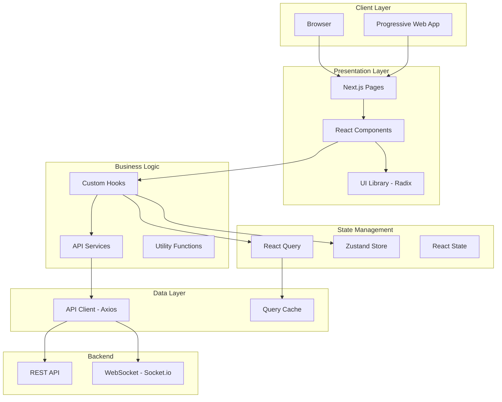
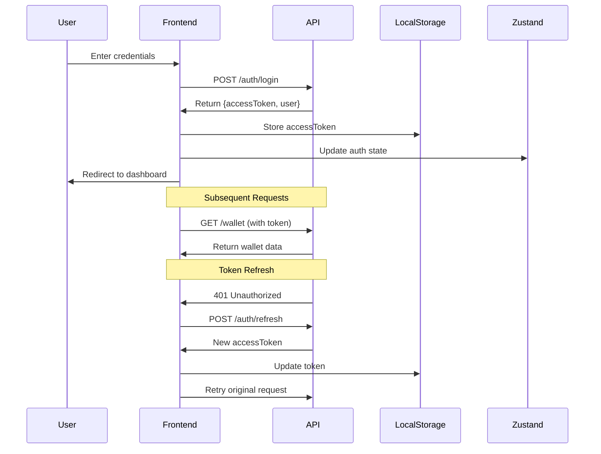

# Novunt Finance Frontend Architecture

## Overview

The Novunt Finance frontend is built using modern web technologies with a focus on performance, type safety, and developer experience. This document outlines the architecture, design decisions, and best practices.

## Architecture Diagram



## Key Design Decisions

### 1. **Next.js App Router**
- Server-side rendering for better SEO and initial load performance
- File-based routing for intuitive project structure
- Automatic code splitting per route
- Built-in image optimization

### 2. **TypeScript Strict Mode**
- Type safety throughout the codebase
- Better IDE support and autocomplete
- Catch errors at compile time
- Self-documenting code

### 3. **TanStack Query (React Query)**
- Server state management
- Automatic caching and revalidation
- Optimistic updates
- Background refetching
- Request deduplication

### 4. **Zustand for Client State**
- Lightweight and performant
- Simple API
- TypeScript-friendly
- No boilerplate code
- Persist middleware for localStorage

### 5. **Component Architecture**
- Atomic design principles
- Composition over inheritance
- Smart/Dumb component pattern
- Error boundaries at route level

## Directory Structure Details

### `/app` - Application Routes
```
app/
├── (auth)/          # Public routes (login, signup)
├── (dashboard)/     # Protected dashboard routes
├── (admin)/         # Admin-only routes
├── api/             # API route handlers (proxy)
├── layout.tsx       # Root layout
└── error.tsx        # Global error handler
```

### `/components` - React Components
```
components/
├── ui/              # Base UI components (buttons, cards, etc.)
├── auth/            # Authentication-related components
├── dashboard/       # Dashboard-specific components
├── wallet/          # Wallet management components
├── stake/           # Staking components
└── ErrorBoundary.tsx # Error boundary wrapper
```

### `/lib` - Utilities & Configuration
```
lib/
├── api.ts           # Axios client with interceptors
├── logger.ts        # Centralized logging
├── error-utils.ts   # Error handling utilities
├── features.ts      # Feature flags
├── queries/         # React Query query hooks
├── mutations/       # React Query mutation hooks
└── test-utils.tsx   # Testing utilities
```

### `/services` - API Service Layer
```
services/
├── walletApi.ts
├── stakingApi.ts
├── authApi.ts
├── referralApi.ts
└── ...
```

Each service file contains functions that interact with specific backend API endpoints.

### `/store` - Zustand Stores
```
store/
├── authStore.ts     # Authentication state
├── uiStore.ts       # UI state (modals, theme, etc.)
├── walletStore.ts   # Wallet state
└── ...
```

### `/types` - TypeScript Definitions
```
types/
├── api.ts           # API request/response types
├── user.ts          # User-related types
├── wallet.ts        # Wallet types
├── staking.ts       # Staking types
└── ...
```

## Data Flow

### 1. **Server State (API Data)**

```typescript
// 1. Define service function
export async function getWalletBalance() {
  return api.get('/wallet/balance');
}

// 2. Create React Query hook
export function useWalletBalance() {
  return useQuery({
    queryKey: ['wallet', 'balance'],
    queryFn: getWalletBalance,
  });
}

// 3. Use in component
function WalletCard() {
  const { data, isLoading } = useWalletBalance();
  
  if (isLoading) return <Skeleton />;
  return <div>{data.balance}</div>;
}
```

### 2. **Client State (UI State)**

```typescript
// 1. Define store
export const useUIStore = create<UIStore>((set) => ({
  isModalOpen: false,
  openModal: () => set({ isModalOpen: true }),
  closeModal: () => set({ isModalOpen: false }),
}));

// 2. Use in component
function MyComponent() {
  const { isModalOpen, openModal } = useUIStore();
  
  return (
    <button onClick={openModal}>
      Open Modal
    </button>
  );
}
```

## Authentication Flow



## Error Handling Strategy

### 1. **API Errors**
- Intercepted at Axios level
- Standardized error format
- Automatic token refresh on 401
- User-friendly error messages

### 2. **React Errors**
- Error boundaries wrap routes
- Fallback UI for crashed components
- Error logging in production

### 3. **Form Validation**
- Client-side validation with Zod
- Real-time feedback
- Server-side validation errors displayed

## Performance Optimizations

### 1. **Code Splitting**
- Automatic route-based splitting
- Dynamic imports for heavy components
- Lazy loading for modals

### 2. **Data Fetching**
- React Query caching
- Background revalidation
- Optimistic updates
- Request deduplication

### 3. **Rendering**
- React.memo for expensive components
- UseMemo/useCallback where appropriate
- Virtual scrolling for long lists (if needed)

### 4. **Assets**
- Next.js Image optimization
- WebP format for images
- SVG for icons (Lucide)

## Security Considerations

### 1. **Authentication**
- JWT tokens stored in localStorage
- Automatic token refresh
- Logout on token expiration
- HTTPS only in production

### 2. **Input Sanitization**
- DOMPurify for user-generated content
- Zod schema validation
- XSS prevention

### 3. **API Security**
- CORS configuration
- Rate limiting (backend)
- CSRF protection

## Testing Strategy

### 1. **Unit Tests**
- Utility functions
- Custom hooks
- Pure components

### 2. **Integration Tests**
- API integration
- Authentication flows
- Form submissions

### 3. **Component Tests**
- User interactions
- State changes
- Error states

## Accessibility

- Semantic HTML
- ARIA labels
- Keyboard navigation
- Screen reader support
- Color contrast compliance

## Future Enhancements

1. **Progressive Web App**
   - Offline support
   - Push notifications
   - App-like experience

2. **Real-time Features**
   - Live price updates via WebSocket
   - Real-time notifications

3. **Advanced Analytics**
   - User behavior tracking
   - Performance monitoring
   - Error tracking (Sentry)

4. **Internationalization**
   - Multi-language support
   - Currency formatting

## Troubleshooting

### Common Issues

1. **CORS Errors**
   - Ensure backend CORS is configured
   - Check API_URL environment variable

2. **Authentication Issues**
   - Clear localStorage
   - Check token expiration

3. **Build Errors**
   - Clear .next folder
   - Delete node_modules and reinstall

## Resources

- [Next.js Documentation](https://nextjs.org/docs)
- [React Query Documentation](https://tanstack.com/query)
- [TailwindCSS Documentation](https://tailwindcss.com)
- [Zustand Documentation](https://github.com/pmndrs/zustand)
